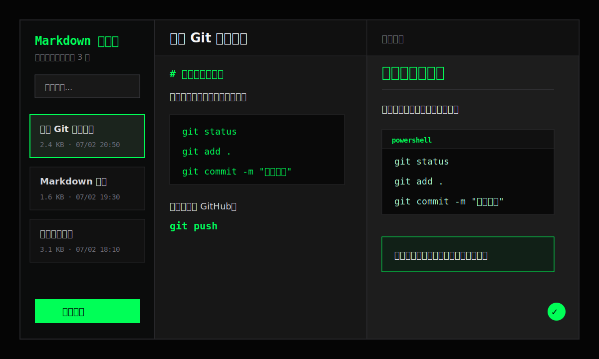

# Markdown 笔记本


这是一个用来练习前端开发和 Git 流程的小项目。它的目标很明确：做一个能写 Markdown、能实时预览、能保存笔记的网页笔记本。

你可以把它当成一个学习项目，也可以继续把它扩展成自己的知识库工具。

## 界面预览



## 已完成功能

| 功能 | 说明 |
| --- | --- |
| 左侧笔记列表 | 展示所有笔记，支持选中当前笔记 |
| 新建笔记 | 点击按钮后创建一条空白笔记 |
| 编辑标题 | 在编辑区顶部修改当前笔记标题 |
| 编辑正文 | 在中间区域输入 Markdown 内容 |
| 实时预览 | 右侧区域同步渲染 Markdown |
| 代码高亮 | Markdown 代码块会按语言高亮显示 |
| 搜索笔记 | 根据标题和正文过滤笔记列表 |
| 删除笔记 | 删除前弹出确认，避免误删 |
| 自动保存 | 修改后自动保存到浏览器本地 |
| 响应式布局 | 桌面端三栏显示，小屏幕自动上下排列 |

## 页面结构

```text
左侧：笔记列表
中间：Markdown 编辑器
右侧：Markdown 预览区
```

这个布局适合边写边看。左侧负责管理笔记，中间负责输入，右侧负责查看最终效果。

## 数据保存在哪里

当前版本没有连接后端数据库。笔记数据保存在浏览器的本地存储里。

保存位置：

```text
浏览器 LocalStorage
```

项目中使用的存储 key：

```text
markdown-notes
```

相关代码位置：

```text
src/App.tsx
src/hooks/useLocalStorage.ts
```

注意：如果你换浏览器、清理浏览器数据、换电脑，原来的笔记不会自动同步。后续如果要做成真正可长期使用的产品，需要增加后端接口和数据库。

## 本地运行

先安装依赖：

```powershell
npm install
```

启动开发服务器：

```powershell
npm run dev
```

浏览器打开终端中显示的地址，一般是：

```text
http://localhost:5173/
```

## 项目命令

| 命令 | 用途 |
| --- | --- |
| `npm run dev` | 启动本地开发服务器 |
| `npm run build` | 打包生产版本 |
| `npm run lint` | 检查代码问题 |
| `npm run preview` | 预览打包后的页面 |

## Git 学习记录

这个项目也用来练习 Git 的常用功能。

已经练习过的内容：

- 初始化仓库：`git init`
- 查看状态：`git status`
- 添加暂存：`git add .`
- 提交版本：`git commit -m "提交说明"`
- 连接远程仓库：`git remote add origin 仓库地址`
- 推送到云端：`git push`
- 创建和切换分支：`git switch -c 分支名`
- 合并分支：`git merge 分支名`
- 查看提交历史：`git log --oneline`

日常开发可以按这个流程走：

```text
1. 修改代码或文档
2. git status 查看变更
3. git add . 添加到暂存区
4. git commit -m "说明这次改了什么"
5. git push 推送到 GitHub
```

## 后续计划

- 增加笔记分类
- 增加标签功能
- 增加导出 Markdown 文件
- 增加导入 Markdown 文件
- 增加主题切换
- 增加云端同步

## 当前定位

这是一个学习型项目，重点不是一次性做完所有功能，而是通过一个真实的小项目，把 React、TypeScript、Markdown 渲染、浏览器本地存储和 Git 工作流串起来。
